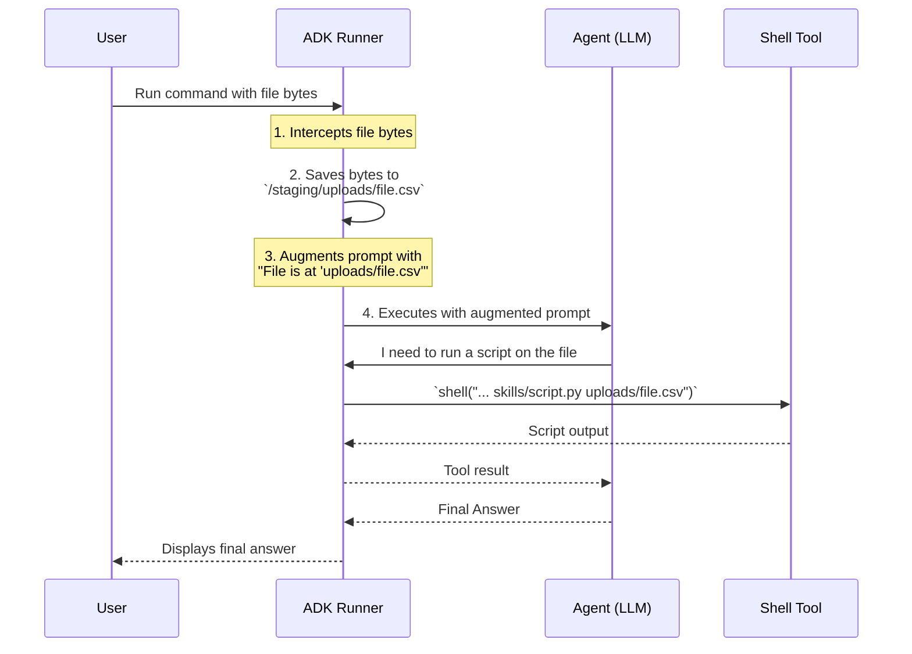

# ADK Skills: Architecture and Design

This document outlines the architecture for the filesystem-based Skills feature in ADK.

---

## 1. Core Philosophy

The design is centered around a **shell-based interaction model**. This empowers the agent with a flexible, universal interface (a secure shell) to interact with a structured filesystem of skills. This model is favored over a programmatic "managed" model because it offers superior flexibility and extensibility, better aligning with the goal of creating autonomous, capable agents.

The agent is taught a "Progressive Disclosure" pattern: it first discovers what skills are available, then investigates the instructions for a relevant skill, and only then executes its scripts or uses its detailed knowledge.

---

## 2. Current Implementation

The implementation consists of three main components that work together to provide the skills functionality.

### a. Skill Directory Structure

Skills are organized in a simple, conventional filesystem structure. Each skill is a self-contained directory that must contain a `SKILL.md` file and can optionally include scripts and a `requirements.txt`.

```
skills/
├── data-analysis/
│   ├── SKILL.md            # Metadata (frontmatter) and instructions (markdown)
│   ├── requirements.txt    # (Optional) Python dependencies for this skill
│   └── scripts/
│       └── data_quality_check.py
└── pdf-processing/
    └── SKILL.md
```

### b. The `SkillsPlugin`

This plugin is the primary entry point for enabling skills in an ADK application. It automates the integration process and has two main responsibilities:

1.  **Inject the Tool:** It adds an instance of the `SkillsShellTool` to the agent's toolset.
2.  **Inject the "Level 1" Prompt:** On startup, it scans the `skills/` directory, parses the YAML frontmatter (`name`, `description`) from all `SKILL.md` files, and prepends a concise summary of available skills to the agent's system prompt.

### c. The `SkillsShellTool`

This is the core execution engine. It is a single, secure tool that provides a `shell(command: str)` function.

- **Functionality:** It allows the agent to run basic shell commands like `ls`, `cat`, `head`, `grep`, `find`, `python`, and `pip`.
- **Security:** It is a hardened, sandboxed shell, not a full `bash` equivalent. It enforces a command whitelist, prevents directory traversal (`..`), and blocks access outside of its root directory to ensure safe execution.

---

## 3. Architectural Challenge & Proposed Solution: File Handling

### a. The Problem: Disconnected Contexts

A critical challenge arises when a user uploads a file (e.g., a CSV for analysis). The file's content is passed to the LLM via its API context, but this file **does not exist on the filesystem** that the `SkillsShellTool` operates on.

This creates a disconnect. The agent is aware of the file's content but cannot use any of its file-based tools (like a Python script) on it directly. Forcing the agent to manually recreate the file using `echo` is inefficient, error-prone, and fails for binary files.

### b. The Solution: Runner-Managed Staging Area

The ADK Runner itself must be responsible for bridging this context gap. This makes the process seamless for the agent.

**Proposed Workflow:**

1.  **File Ingestion:** The ADK Runner receives a message containing a user-uploaded file.
2.  **Save to Staging Area:** The Runner saves the file's bytes to a temporary, session-specific directory. For example: `.../adk_sessions/<session_id>/uploads/my_data.csv`.
3.  **Augment the Prompt:** The Runner modifies the prompt sent to the LLM, adding a message that informs the agent of the file's existence and its path within the tool environment (e.g., "The user uploaded `my_data.csv`, which is available at `uploads/my_data.csv`").
4.  **Seamless Tool Use:** The agent, now aware of the file's location on its virtual filesystem, can use its `shell` tool to run scripts on that path directly and naturally.

**Diagram of the Proposed Flow:**


