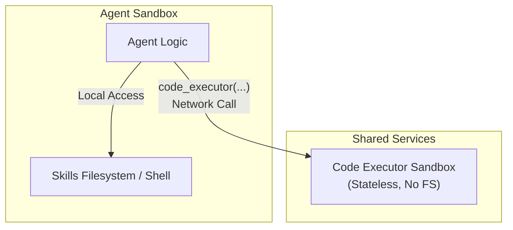
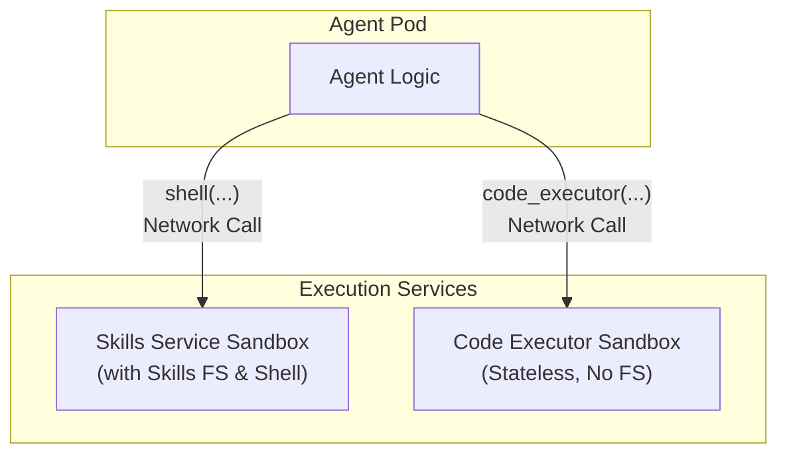
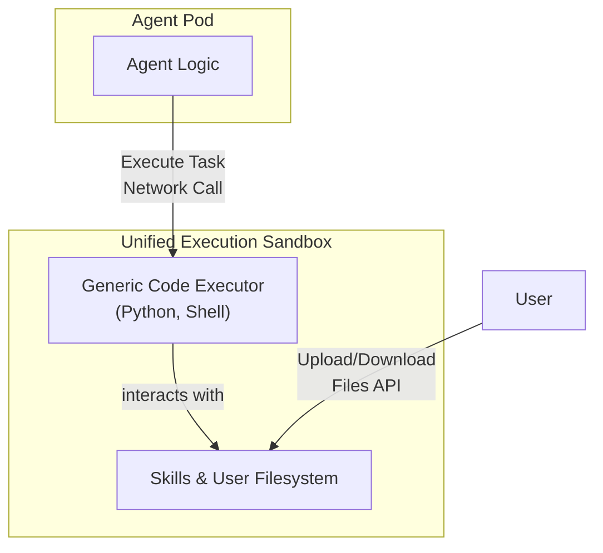

# ADK Agent Sandboxing Architectures

This document outlines potential high-level architectures for deploying the ADK agent, its skills, and its code execution capabilities within a secure, sandboxed environment.

---

## 1. Core Architectural Requirements

A production-grade agent architecture must satisfy the following:

- **Security:** Isolate components, especially for untrusted LLM-generated code, according to the Principle of Least Privilege.
- **Performance:** Minimize latency for frequent operations like accessing skill files.
- **Scalability & Efficiency:** Allow components to scale independently and share resources where appropriate.
- **Clarity & Maintainability:** The roles and boundaries of each component should be clear and unambiguous.

---

## 2. Candidate Architectures

### Design 1

- **Pros:**
  - **High Performance:** Common operations (interacting with skills) are local with zero network latency.
  - **Strong Security:** The most dangerous operations (running LLM-generated code) are properly isolated in a dedicated, stateless sandbox.
  - **Resource Efficient:** The `Code Executor` can be a shared pool for all agents.
- **Cons:**
  - Requires managing two distinct service types.

### Design 2

- **Pros:**
  - **Maximum Security:** The purest implementation of the Principle of Least Privilege.
  - **Independent Scaling:** All components can be scaled independently.
- **Cons:**
  - **Highest Complexity:** Requires deploying and managing three distinct services.
  - **High Latency:** Every tool call, including simple `ls` or `cat` commands, incurs network overhead.

### Design 3

- **Pros:**
  - **Conceptual Simplicity:** The agent has only one powerful execution tool, and the file context is never disconnected.
  - **Closely Aligned with Original Docs:** Mirrors the concept of a single, powerful "container" for skills and code.
- **Cons:**
  - **Significant Security Risk:** Violates the Principle of Least Privilege by allowing the environment for untrusted, LLM-generated code to have full access to the trusted skills filesystem.
  - **Stateful Complexity:** The service must manage isolated filesystems for many concurrent sessions, which is a major engineering challenge.

## 3. Further Questions

1. How do we manage skills (e.g. CRUD) like the Claude Skills API where users can upload and manage skills from the client as a zip file? How to let the user select which uploaded skills are available to which agents?

2. How do we add skills to the shell / FS? Currently we just assume a local `skills/` directory. Do we need a skill management service or some sort of volume mount?

3. Agents might generate files or require files to be uploaded to the FS. The former is done by a files API in Claude, where you separately request the file to be downloaded after the agent run from the code execution environment. The latter doesn't seem to be handled at all, all the Skills examples from Claude are just sending data inline in the prompt. However, the latter is important if you want Claude to analyze a user-uploaded CSV or PDF using a skill script. How do we handle this file context disconnect between the LLM and the shell FS? **I tried an artifact service based approach but it is not extensible to production because it uses simple local files.**
