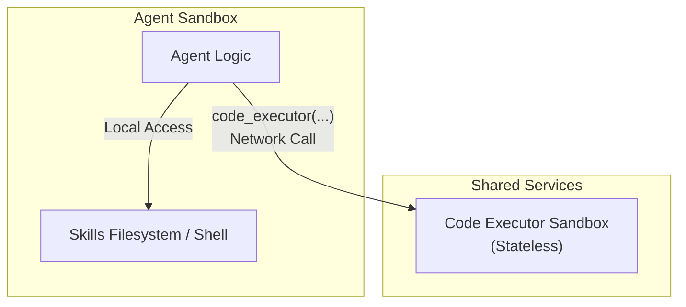
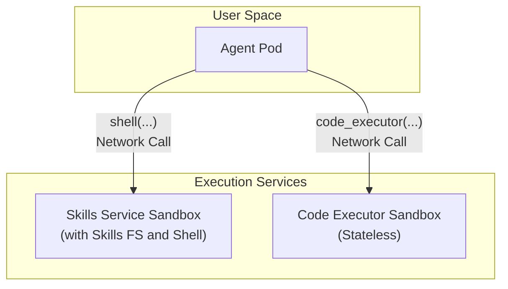

# Skills and Code Execution with Kagent ADK

This document outlines two recommended high-level architectures for deploying the ADK agent, its skills, and its code execution capabilities within a secure, sandboxed environment.

---

## 1. Architectural Requirements

A production-grade agent architecture must satisfy the following core requirements:

- **Security:** Employ a defense-in-depth strategy. Components, especially those running untrusted LLM-generated code, must be isolated according to the Principle of Least Privilege.
- **Performance:** Frequent operations, such as accessing skill files and running trusted scripts, should have minimal latency.
- **Scalability:** Individual components (agents, code executors) should be able to scale independently based on their specific loads.
- **Resource Efficiency:** Shared services should be used where appropriate to avoid redundant resource allocation across many agents.
- **Clarity:** The roles and boundaries of each component should be clear and unambiguous to ensure predictable agent behavior and maintainability.

---

## 2. Proposed Architectures

### Design 1

- **Excellent Performance:** Accessing skill files and running shell commands is done locally within the agent sandbox, minimizing latency.
- **Strong Security:** Running dangerous LLM-generated code are properly isolated in a dedicated, stateless service.
- **Resource Efficient:** The `Code Executor` can be a shared pool of resources for all agents, which is highly efficient.

### Design 2

- **Pros:**

  - **Maximum Security:** The purest implementation of the Principle of Least Privilege. Each component has exactly the permissions it needs and no more.
  - **Independent Scaling:** All three components can be scaled independently based on demand.

- **Cons:**
  - **Highest Complexity:** Requires deploying and managing three distinct services, increasing operational overhead.
  - **High Latency:** Every tool call, including simple `ls` or `cat` commands for skills, incurs network overhead, which can make the agent feel slow.
  - Attaching Skills FS to a separate service may require additional engineering effort.
